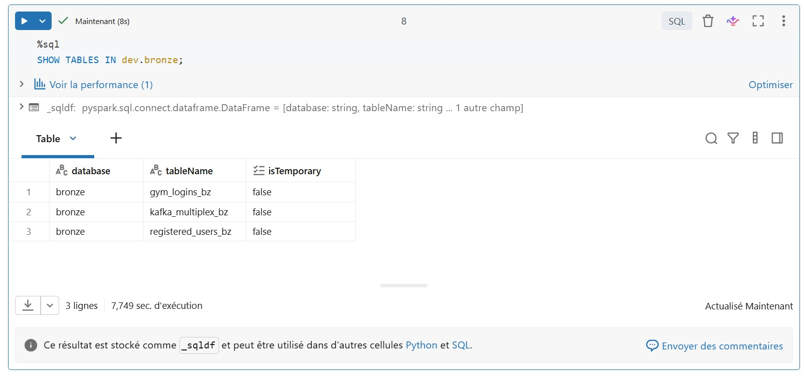
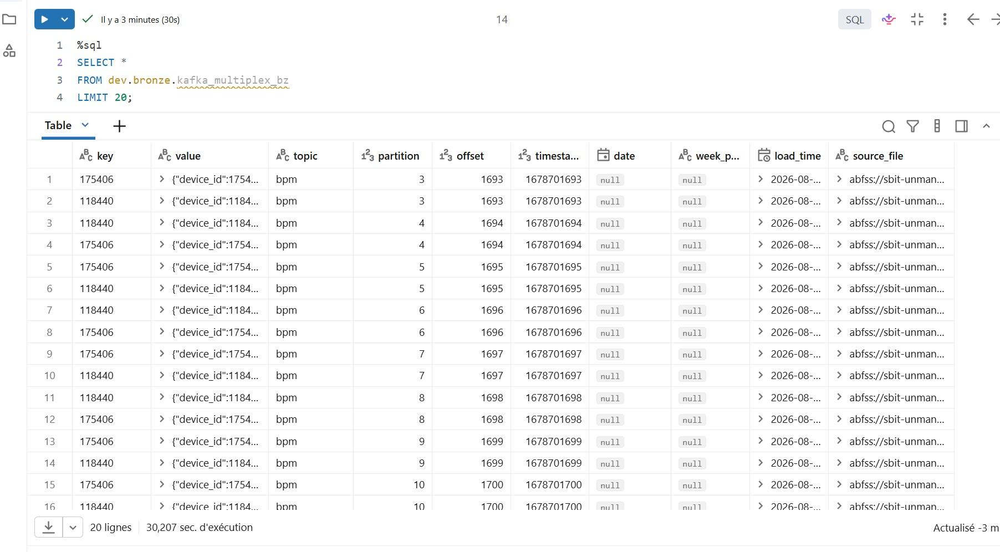
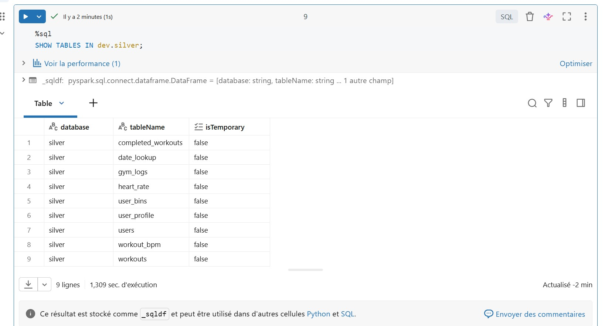
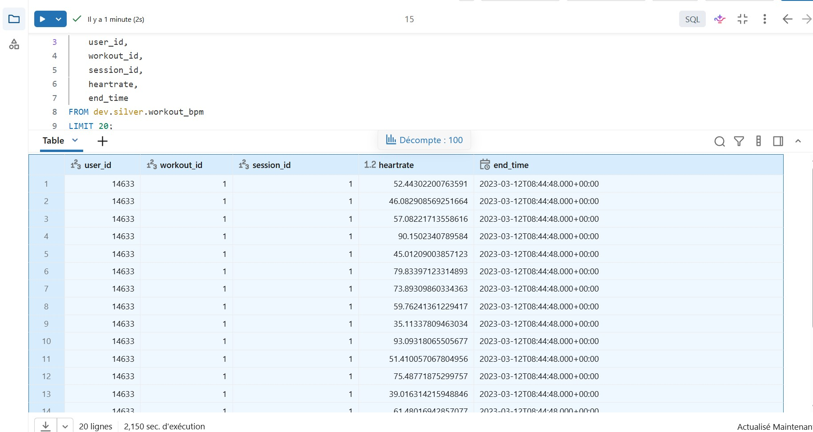
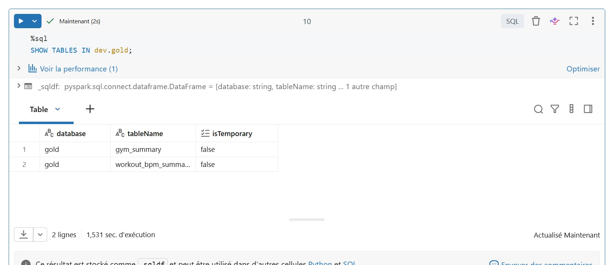
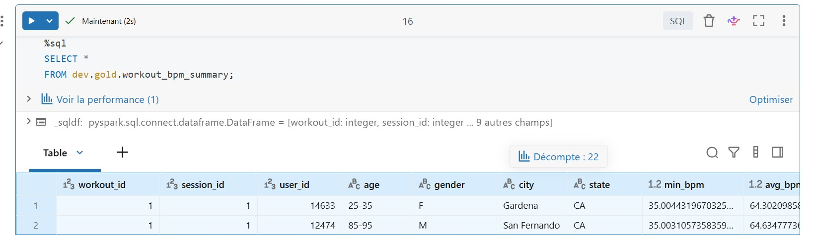
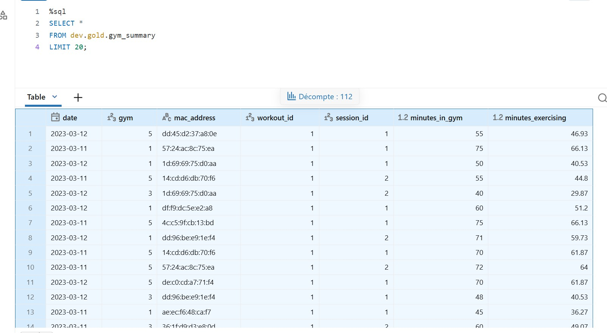
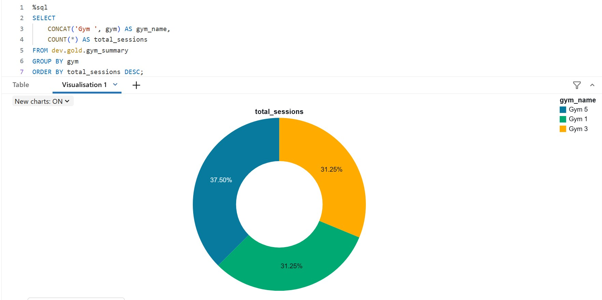
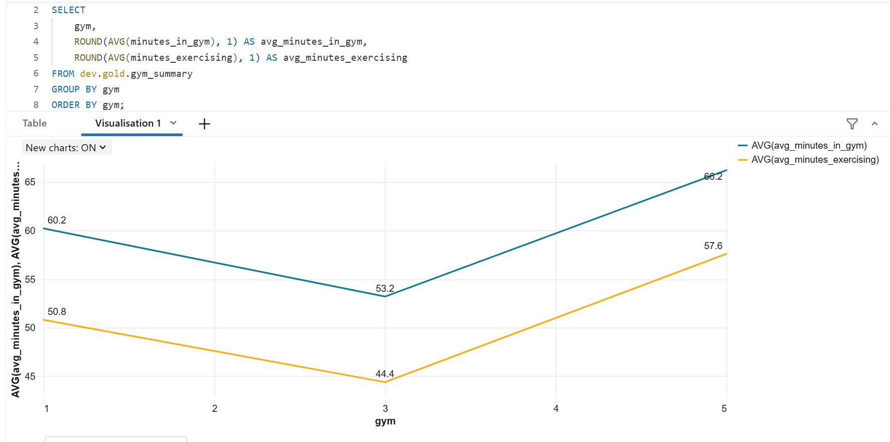
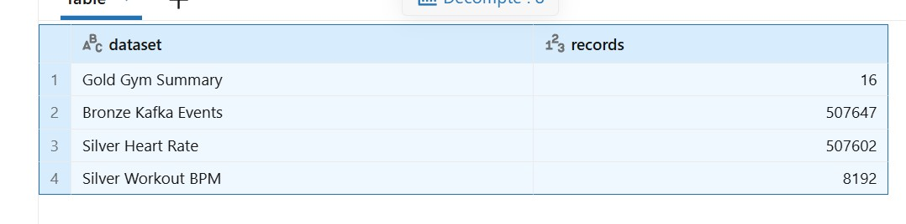

# Azure Databricks Real-Time Health Data Platform

## Project Overview

This project is an end-to-end Data Engineering platform built with **Azure Databricks**.

The project simulates a company that manufactures wearable fitness devices.

Users wear a connected device that continuously generates health and activity data.  
The goal is to collect this data, process it through a Lakehouse architecture and create clean datasets that can be used for analytics.

The platform was built using a **Medallion Architecture**:

**Bronze → Silver → Gold**

The project also includes:

- batch processing
- incremental ingestion
- Structured Streaming
- Auto Loader
- Change Data Capture (CDC)
- Delta Lake
- Unity Catalog
- Azure Data Lake Storage Gen2
- integration testing
- Git and GitHub
- GitHub Actions CI/CD
- Azure Databricks Serverless compute

---

# Business Context

The scenario is based on a company selling connected fitness watches.

When a customer purchases a device, several systems start generating data.

The platform must collect these different datasets and transform them into useful information for the company and its partner fitness centers.

The final goal is to produce two analytics datasets:

- **Workout BPM Summary**
- **Gym Summary**

---

# Source Data

The project works with five main datasets.

## 1. Device Registration

When a customer purchases a wearable device, the device is registered.

The registration data contains information such as:

- User ID
- Device ID
- MAC address
- Registration timestamp

In the original business scenario, this information comes from a cloud database.

Example flow:

```text
Wearable Device
      |
      v
Device Registration
      |
      v
Cloud Database
```

---

## 2. User Profile CDC

Users can manage their profile through a mobile application.

The application can generate three types of profile events:

```text
NEW
UPDATE
DELETE
```

This means that the dataset is a **Change Data Capture dataset**.

Example:

```text
User creates profile
       |
       v
NEW event

User modifies profile
       |
       v
UPDATE event

User deletes profile
       |
       v
DELETE event
```

These events are simulated as Kafka-style JSON messages.

---

## 3. Heart Rate / BPM Stream

The wearable device continuously measures the user's heart rate.

Each event contains information such as:

```text
device_id
timestamp
heartrate
```

This represents the highest-volume dataset in the project.

In the test dataset, more than **500,000 heart-rate events** are processed.

---

## 4. Gym Login / Logout Events

Partner fitness centers contain device scanners.

When a user enters a gym, a login event is generated.

When the user leaves, a logout event is generated.

These events make it possible to calculate:

- time spent inside the gym
- user movement between gym sessions

---

## 5. Workout Sessions

The wearable device contains controls allowing the user to start and stop a workout.

The platform therefore receives:

```text
Workout START
Workout STOP
```

These events are later combined with BPM measurements to understand the user's heart rate during exercise.

---

# High-Level Architecture

The complete data flow is:

```text
                  SOURCE SYSTEMS
                        |
        +---------------+---------------+
        |               |               |
 Registration       CDC Events      BPM Events
        |               |               |
        +---------------+---------------+
                        |
                 Raw Landing Zone
                        |
                        v
                 BRONZE LAYER
                        |
                        v
                 SILVER LAYER
                        |
                        v
                  GOLD LAYER
                        |
                        v
               Analytics / Reports
```

The platform uses:

```text
Azure Data Lake Storage Gen2
          +
      Unity Catalog
          +
    Azure Databricks
```

---

# Medallion Architecture

## Bronze Layer

The Bronze layer stores data as close as possible to the original source.

The objective is to preserve raw information for:

- traceability
- replay
- troubleshooting
- future transformations

The project contains three Bronze tables:

```text
dev.bronze.registered_users_bz
dev.bronze.gym_logins_bz
dev.bronze.kafka_multiplex_bz
```

### registered_users_bz

Contains raw user and device registration data.

### gym_logins_bz

Contains raw gym login and logout events.

### kafka_multiplex_bz

Contains multiple event types in the same ingestion stream:

- user profile CDC
- BPM measurements
- workout events

This simulates a Kafka-based event ingestion architecture.

### Bronze Tables



### Example Raw Events



---

# Incremental Bronze Ingestion

The Bronze layer uses **Databricks Auto Loader** and **Structured Streaming**.

Instead of reading all files again during every execution, Databricks processes only new files.

The general flow is:

```text
New Files
   |
   v
Raw Storage
   |
   v
Auto Loader
   |
   v
Structured Streaming
   |
   v
Bronze Delta Tables
```

Streaming checkpoints keep track of files that have already been processed.

---

# Silver Layer

The Silver layer converts the raw data into clean and structured business entities.

The project contains several Silver tables including:

```text
users
gym_logs
user_profile
heart_rate
workouts
completed_workouts
workout_bpm
user_bins
date_lookup
```

### Main Silver transformations

The Silver layer performs:

- data cleaning
- schema normalization
- deduplication
- CDC processing
- timestamp conversion
- joins
- enrichment
- workout reconstruction
- BPM-to-workout matching

### Silver Tables



---

# User Processing

The raw registration data is transformed into the Silver `users` table.

Example:

```text
registered_users_bz
        |
        v
Cleaning / Deduplication
        |
        v
silver.users
```

This produces one clean representation of each registered user and device.

---

# CDC Processing

User profile events can contain several updates for the same user.

For example:

```text
User 100
NEW
UPDATE
UPDATE
```

Before applying the updates, records are ranked by timestamp.

Only the latest relevant event is kept for the update operation.

Delta Lake `MERGE` is then used to perform:

```text
INSERT
UPDATE
DELETE
```

This ensures that the Silver profile table represents the latest state of each user.

---

# Multiple CDC Updates

One important challenge was handling multiple updates for the same user inside the same micro-batch.

The solution was to:

1. partition records by user
2. order them by update timestamp
3. keep the latest record
4. apply the result using Delta `MERGE`

This prevents conflicting updates during streaming processing.

---

# Heart Rate Processing

The BPM stream contains a very large number of measurements.

Example record:

```text
device_id
timestamp
heartrate
```

The raw BPM events are transformed into:

```text
dev.silver.heart_rate
```

The project contains approximately:

```text
507,602 Silver heart-rate records
```

---

# Workout Processing

Workout start and stop events are combined to reconstruct completed workout sessions.

The processing flow is:

```text
Workout START
      +
Workout STOP
      |
      v
Completed Workout
```

The result is stored in:

```text
dev.silver.completed_workouts
```

---

# Workout BPM Matching

Heart-rate measurements are then matched with workout sessions.

This produces:

```text
dev.silver.workout_bpm
```

This table contains BPM measurements that occurred during a valid workout session.

Example columns include:

```text
user_id
workout_id
session_id
heartrate
end_time
```

The project contains:

```text
8,192 workout BPM records
```

### Silver Workout BPM



A single user and workout can therefore contain many BPM measurements.

---

# Gold Layer

The Gold layer contains datasets designed for analytics and reporting.

The project produces two main Gold datasets:

```text
dev.gold.workout_bpm_summary
dev.gold.gym_summary
```

### Gold Tables



---

# Workout BPM Summary

The Workout BPM Summary converts detailed heart-rate measurements into workout-level statistics.

The aggregation calculates values such as:

- minimum heart rate
- average heart rate
- maximum heart rate
- number of BPM measurements
- workout information
- session information

The transformation is approximately:

```text
Thousands of BPM Measurements
            |
            v
       GROUP BY
User + Workout + Session
            |
            v
Min BPM / Avg BPM / Max BPM
```

### Gold Workout Summary



---

# Gym Summary

The second Gold dataset is:

```text
dev.gold.gym_summary
```

It combines gym visits with workout activity.

The final table contains information such as:

- date
- gym
- device MAC address
- workout
- session
- minutes spent inside the gym
- minutes spent exercising

### Gold Gym Summary



This dataset can be directly consumed by reporting tools.

---

# Analytics

The Gold datasets can be used to generate simple business insights.

## Gym Session Distribution

The following visualization shows the distribution of recorded sessions across the different gym locations.



The sessions are relatively balanced across the three gym locations.

---

## Average Gym Time vs Exercise Time

This visualization compares:

- average time spent inside the gym
- average time spent exercising



This can help fitness centers understand the difference between total customer presence and effective exercise time.

---

# Data Volume Across the Medallion Architecture

The project processes more than half a million source events.

| Dataset | Records |
|---|---:|
| Bronze Kafka Events | 507,647 |
| Silver Heart Rate | 507,602 |
| Silver Workout BPM | 8,192 |
| Gold Gym Summary | 16 |



This illustrates how the data becomes more focused as it moves through the Lakehouse.

```text
507,647 Raw Events
        |
        v
507,602 Clean Heart Rate Events
        |
        v
8,192 BPM Measurements During Workouts
        |
        v
Business-Level Gold Summaries
```

Bronze keeps raw events.

Silver creates clean and usable datasets.

Gold produces compact datasets optimized for analytics.

---

# Azure Data Lake Storage

Azure Data Lake Storage Gen2 is used as the main storage layer.

The project separates different types of files such as:

```text
data_zone/
    raw/
    test_data/

checkpoint_zone/
    checkpoints/
```

The storage is accessed through Unity Catalog External Locations.

This means notebooks do not directly contain Azure storage credentials.

---

# Unity Catalog

Unity Catalog is used for governance and organization.

The main project catalog is:

```text
dev
```

The Medallion schemas are:

```text
dev.bronze
dev.silver
dev.gold
```

The project therefore follows:

```text
Catalog
  |
  +-- bronze
  |
  +-- silver
  |
  +-- gold
```

Unity Catalog is placed between compute and storage and provides centralized access control and governance.

---

# External Locations

Two main External Locations are used:

```text
data_zone
checkpoint_zone
```

The configuration notebook dynamically retrieves their storage paths.

This avoids hardcoding long Azure storage URLs directly inside each processing notebook.

---

# Serverless Databricks

The implementation uses **Azure Databricks Serverless**.

Some parts of the original architecture were adapted because the original project examples were designed for classic Databricks clusters.

For example:

- manual Spark optimization properties are not required
- some classic cluster configurations are not available
- file metadata uses the Databricks `_metadata` column
- integration testing was adapted to Serverless execution

---

# Notebook Architecture

The project is separated into small notebooks, each responsible for a specific part of the platform.

```text
01-config
02-setup
03-history-loader
04-bronze
05-silver
06-gold
07-run
08-batch-test
09-stream-test
10-producer
```

---

## 01-config.ipynb

Centralizes project configuration.

It retrieves the physical paths of:

```text
data_zone
checkpoint_zone
```

from Unity Catalog.

It also defines:

- Bronze schema
- Silver schema
- Gold schema
- Auto Loader configuration
- checkpoint locations

This avoids duplicating configuration across notebooks.

---

## 02-setup.ipynb

Creates the project database objects.

It prepares:

```text
Bronze tables
Silver tables
Gold tables
```

It also contains helper methods to:

- create schemas
- create tables
- validate the environment
- clean test objects

---

## 03-history-loader.ipynb

Loads historical reference data.

The main historical dataset is:

```text
dev.silver.date_lookup
```

It contains a date dimension used during processing.

The loader validates that the expected historical records were loaded correctly.

---

## 04-bronze.ipynb

Implements the Bronze ingestion layer.

It creates streaming ingestion for:

```text
registered users
gym logins
Kafka multiplex events
```

The notebook uses:

- Auto Loader
- Structured Streaming
- Delta tables
- checkpoints
- source file metadata

The Bronze layer performs minimal transformations.

---

## 05-silver.ipynb

Contains the main transformation logic.

It processes:

```text
users
gym logs
user profiles
workouts
heart rate
user bins
completed workouts
workout BPM
```

The notebook performs:

- CDC handling
- MERGE operations
- deduplication
- joins
- filtering
- session reconstruction
- enrichment

This is the main business transformation layer of the project.

---

## 06-gold.ipynb

Creates the final analytical datasets.

It builds:

```text
workout_bpm_summary
gym_summary
```

The Gold layer performs aggregations and prepares reporting-ready information.

---

## 07-run.ipynb

Acts as the main pipeline orchestrator.

It creates the layer objects:

```text
Bronze
Silver
Gold
```

and runs them in sequence:

```text
Bronze
   |
   v
Silver
   |
   v
Gold
```

The notebook can execute the complete data pipeline.

---

# Test Data Producer

## 10-producer.ipynb

The Producer notebook simulates data arriving from real external systems.

Source test files are stored in:

```text
data_zone/test_data
```

The Producer copies them into the Raw Landing Zone.

Example:

```text
test_data
    |
    v
Producer
    |
    v
raw
    |
    v
Auto Loader
```

Two incremental payloads are used.

### Payload 1

Contains the first group of test data.

### Payload 2

Contains additional records and updates.

Payload 2 is not a copy of Payload 1.

It represents new incoming data.

This allows the project to test incremental processing.

---

# Integration Testing

The project includes both Batch and Streaming integration tests.

This is important because the objective is not only to create tables, but also to validate the full platform automatically.

---

# Batch Integration Test

The Batch test is implemented in:

```text
08-batch-test.ipynb
```

The test follows this sequence:

```text
Clean Environment
      |
      v
Load Historical Data
      |
      v
Produce Payload 1
      |
      v
Run Bronze → Silver → Gold
      |
      v
Validate Results
      |
      v
Produce Payload 2
      |
      v
Run Pipeline Again
      |
      v
Validate Final Results
```

The test checks record counts and expected Gold results.

---

# Streaming Integration Test

The Streaming integration test is implemented in:

```text
09-stream-test.ipynb
```

Its purpose is to verify incremental processing behavior.

Conceptually:

```text
Start Pipeline
      |
      v
Wait for Data
      |
      +---- Payload 1 arrives
      |
      v
Process New Data
      |
      +---- Payload 2 arrives
      |
      v
Process Only New Data
```

Checkpoints prevent previously processed data from being processed again.

Because the project uses Serverless, the streaming test was adapted from the original classic-cluster implementation.

---

# Checkpoint Management

During testing, streaming checkpoints were also validated.

A checkpoint contains information used by Spark to remember:

```text
offsets
commits
sources
stream metadata
```

This is essential for reliable incremental processing.

The project includes reset logic for controlled integration testing.

---

# Batch vs Streaming

The project supports both execution patterns.

## Batch

```text
Data arrives
     |
     v
Pipeline starts
     |
     v
Process available data
     |
     v
Pipeline stops
```

## Streaming

```text
Pipeline starts
     |
     v
Wait for events
     |
     v
New data arrives
     |
     v
Process incrementally
```

This demonstrates the difference between scheduled processing and continuous/incremental processing.

---

# Source Control

The project is version controlled using:

```text
Git
GitHub
Databricks Git Folder
VS Code
```

The Databricks project is connected to a GitHub repository.

Development follows a branch-based workflow.

Example:

```text
github-cicd
     |
     v
Commit
     |
     v
Push
     |
     v
Pull Request
     |
     v
CI Validation
     |
     v
Merge
     |
     v
main
```

---

# GitHub Actions CI

Continuous Integration is implemented with GitHub Actions.

The workflow is located in:

```text
.github/workflows/ci.yml
```

The CI pipeline automatically runs when code is pushed or when a Pull Request is created.

The workflow performs:

```text
Checkout Repository
       |
       v
Start Ubuntu Runner
       |
       v
Setup Python
       |
       v
Install Dependencies
       |
       v
Verify Project Files
       |
       v
Validate Notebook Structure
       |
       v
Validate Python Syntax
       |
       v
Create Build Artifact
```

The CI workflow has already been successfully executed in GitHub Actions.

This allows changes to be validated before being merged into the main branch.

---

# GitHub Actions CD

A Continuous Deployment workflow is also configured in:

```text
.github/workflows/cd.yml
```

Its objective is to reproduce the deployment process that would normally be used in a professional environment.

The planned workflow is:

```text
GitHub Main Branch
       |
       v
GitHub Actions
       |
       v
Databricks CLI
       |
       v
Deploy Notebooks
       |
       v
Create Temporary Job
       |
       v
Run Integration Test
       |
       v
Validate Deployment
```

For this portfolio implementation, deployment is intentionally kept simple and targets the existing Databricks workspace instead of creating separate production infrastructure.

The final end-to-end CD deployment validation is still being completed.

---

# CI/CD Architecture

```text
Developer
    |
    v
VS Code
    |
    v
GitHub Branch
    |
    v
Pull Request
    |
    v
GitHub Actions CI
    |
    +---- Validate notebooks
    |
    +---- Validate project
    |
    +---- Build artifact
    |
    v
Merge to Main
    |
    v
GitHub Actions CD
    |
    v
Databricks CLI
    |
    v
Azure Databricks
```

---

# Project Structure

```text
azure-databricks-realtime-health-platform/
│
├── 01-config.ipynb
├── 02-setup.ipynb
├── 03-history-loader.ipynb
├── 04-bronze.ipynb
├── 05-silver.ipynb
├── 06-gold.ipynb
├── 07-run.ipynb
├── 08-batch-test.ipynb
├── 09-stream-test.ipynb
├── 10-producer.ipynb
│
├── .github/
│   └── workflows/
│       ├── ci.yml
│       └── cd.yml
│
├── docs/
│   └── images/
│       ├── bronze-raw-events.png
│       ├── silver-workout-bpm.png
│       ├── gold-gym-summary.png
│       ├── gold-workout-summary.png
│       ├── gym-sessions-chart.png
│       ├── gym-activity-duration.png
│       ├── data-volume-medallion-layers.png
│       ├── tables-bronze.png
│       ├── tables-silver.png
│       └── tables-gold.png
│
├── .gitignore
└── README.md
```

---

# Technologies

## Cloud

- Microsoft Azure
- Azure Databricks
- Azure Data Lake Storage Gen2

## Data Engineering

- Apache Spark
- PySpark
- Spark Structured Streaming
- Databricks Auto Loader
- Delta Lake
- Delta MERGE
- Change Data Capture
- Medallion Architecture

## Governance

- Unity Catalog
- Catalogs
- Schemas
- External Locations

## Development

- Python
- SQL
- Databricks Notebooks
- Databricks Serverless
- VS Code

## DevOps

- Git
- GitHub
- GitHub Actions
- Pull Requests
- CI/CD
- Databricks CLI

---

# Main Data Engineering Concepts Demonstrated

This project demonstrates practical use of:

- Lakehouse Architecture
- Medallion Architecture
- Bronze / Silver / Gold layers
- high-volume event processing
- batch processing
- streaming processing
- incremental ingestion
- Auto Loader
- CDC
- Delta Lake MERGE
- deduplication
- window functions
- data enrichment
- joins
- aggregations
- streaming checkpoints
- integration testing
- workflow orchestration
- Unity Catalog
- External Locations
- Git branching
- Pull Requests
- Continuous Integration
- Continuous Deployment

---

# Challenges Solved

Several practical problems were handled during the project.

### Multiple CDC updates

Multiple profile updates for the same user can arrive in the same batch.

The solution ranks events and keeps the latest valid update before performing the Delta MERGE.

### Incremental ingestion

Auto Loader and checkpoints prevent the same files from being processed repeatedly.

### Workout reconstruction

Separate workout START and STOP events are combined to reconstruct completed workout sessions.

### BPM matching

Hundreds of thousands of heart-rate events are filtered and matched with valid workout periods.

### Serverless compatibility

Some classic Databricks examples were adapted to work with the current Azure Databricks Serverless environment.

### Integration testing

Payload-based tests were created to validate both initial and incremental data processing.

### CI/CD migration

The original CI/CD concepts were adapted from Azure DevOps to GitHub Actions.

---

# Results

The platform successfully processes more than **500,000 raw events** through the Lakehouse.

Example processing volumes:

```text
Bronze Kafka Events       507,647
Silver Heart Rate         507,602
Silver Workout BPM          8,192
Gold Gym Summary                16
```

The final result is a set of clean, governed and analytics-ready datasets.

---

# What I Learned

This project allowed me to build a complete Azure Databricks Data Engineering workflow rather than only individual notebooks.

I worked on the complete lifecycle:

```text
Source Data
    |
    v
Ingestion
    |
    v
Bronze
    |
    v
Silver
    |
    v
Gold
    |
    v
Analytics
    |
    v
Testing
    |
    v
Git
    |
    v
CI/CD
```

The project helped me understand how ingestion, transformation, governance, testing and deployment fit together in a real Data Engineering platform.